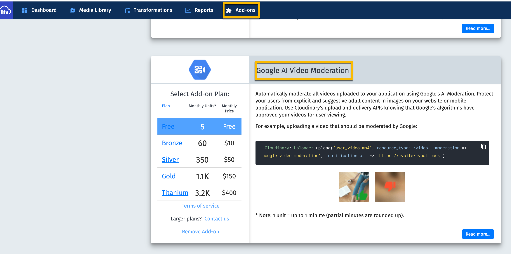

# Moderation Workflow

This is a scenario in which you are allowing your users to upload video.  You want to moderate the video 
before it is made public. 

We're using an Cloudinary Add-on called Google AI Video Moderation.  You can find this in your console under addons. 
 

We upload the video with type `upload` which is public, but we also add `access_control: [{ access_type: 'token' }]` so that no one can access the original video or create and derived videos until moderation is complete and the video has been approved. 

We're using webhooks to let us know when the processing is complete.  After is it completed, we can check the `moderation_status`.   
It will be `approved` or `rejected`.  This will put it into either the approved or rejected queue.  

For this exercise, we have two videos.  A video with a hot tub will be rejected and a video with elephants walking will be accepted.  
We're going to make both of these videos inaccessible on upload using the access_control option with access_type: 'token'.  

The webhook will be called when moderation is complete and the video has been put into the accepted or rejected queue of Google Video Moderation.  There is a 60 second sleep function added to both functions that check the appending and approved Q's. This is for demo purposes. It gives you time to look at the Google 
Video Moderation Qs in the DAM.

```JavaScript
cloudinary.uploader
  .upload('./assets/video/hot-tub.mp4', {
    resource_type: 'video',
    public_id: 'hot-tub',
    access_control: [{ access_type: 'token' }],
    moderation: 'google_video_moderation:possible',
    notification_url:
      '<WEBHOOK URL>'
  })

cloudinary.uploader
  .upload('https://res.cloudinary.com/cloudinary-training/video/upload/v1588613988/elephants.mp4', {
    resource_type: 'video',
    public_id: 'elephants1',
    access_control: [{ access_type: 'token' }],
    moderation: 'google_video_moderation:possible',
    notification_url:
      'https://rpeltz-webhook-processing.netlify.app/.netlify/functions/webhook_clear_google_moderation_approved_queue'
  })
```


For the approved video we'll use 